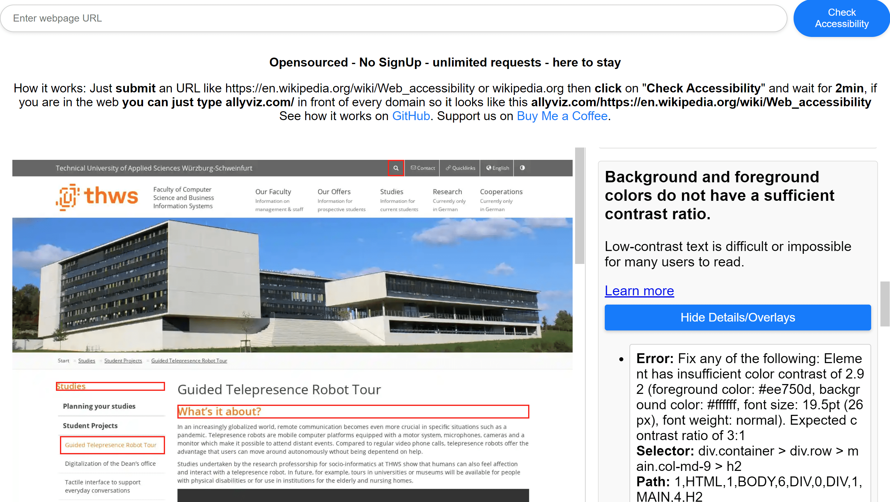

# Accessibility Tool

**Description:** This tool leverages the power of axe-core and Google Lighthouse to offer a straightforward, free resource for identifying and addressing over 50 web accessibility issues. Designed for ease of use, it aims to make the web more accessible to all, including those with disabilities.

## Why

First of all, big thanks go to the team of axe-core and Google Lighthouse, as this page is built on their open-sourced code. Our motivation is to make the web more accessible and to simplify the process for website owners, developers, and users who wish to share issues with website owners, allowing for the checking of over 50 accessibility issues totally for free. While there are more comprehensive tools available, they often require installation, and sharing results is not as straightforward as it is here.

> “For many people, technology makes things easier. For people with disabilities, technology makes things possible. Accessibility means developing content to be as accessible as possible, no matter an individual’s physical and cognitive abilities and how they access the web.”

## How

The code for this tool can be found on our GitHub page. In short, it utilizes Google Lighthouse, whose accessibility section is heavily based on axe-core, and translates the JSON report into a visual interface. This website currently relies on the free Lighthouse API (huge thanks to Google). Should the API be discontinued, we are prepared to host the open-source code on our servers. (Please don’t turn it off.)

## Limitation

This tool is just the beginning; automatic accessibility testing has its limitations. For a more thorough assessment, browser plugins like “Accessibility Insights for Web” offer enhanced capabilities when coupled with human involvement.

## What does allyviz mean?

Accessibility (often abbreviated to A11y — as in, “a”, then 11 characters, and then “y”) in web development signifies enabling as many people as possible to use websites, even those whose abilities are limited in some way. “Ally” seemed cooler than “a11y”, and “viz” stands for visualization, embodying our goal of making accessibility insights more visible and actionable.
